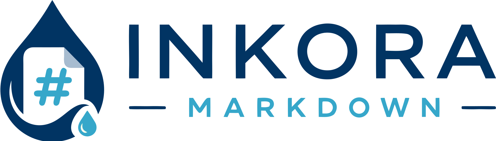

<picture>
  <source media="(prefers-color-scheme: dark)" srcset="assets/lockup-horizontal-dark.svg">
  
</picture>

# Markstrata

*Markdown for SharePoint.*

<!-- The CI and Release badges read the repository through GitHub's public
     endpoints, so they only render once the repository is public: while it is
     private the Actions badge 403s and shields.io reports "repo not found".
     The other four are static and render either way. -->
[](https://github.com/CodyRWhite/Markstrata/actions/workflows/ci.yml)
[](https://github.com/CodyRWhite/Markstrata/releases/latest)
[](https://learn.microsoft.com/en-us/sharepoint/dev/spfx/sharepoint-framework-overview)
[](./LICENSE)
[](https://codywhite.me/Markstrata/demo/)
[](https://buymeacoffee.com/codyrwhite)

A SharePoint Framework (SPFx) web part that renders markdown from a document
library, a URL, or typed straight into the page — with themes that mirror how
**GitHub**, **Obsidian** and **VS Code** display markdown, in light and dark.

**[Try it in your browser](https://codywhite.me/Markstrata/)** —
the live demo runs the web part's own renderer: switch themes, fold callouts,
copy code, and type in the split editor. No install needed.

It was written after living with
[npapadacis/better-markdown-webpart](https://github.com/npapadacis/better-markdown-webpart),
which gets a lot right, and is aimed squarely at the parts that were hard to
live with: **code blocks and note/callout blocks that were difficult to read**,
and a rendering style you could not match to the tools your documentation is
actually written in. The code here is written from scratch.

## What is different

| | Before | Here |
|---|---|---|
| Code block background | Fixed near-black `#212121` in every theme, plus a text shadow and an inset black glow | Theme surface colour, no shadow, no glow |
| Syntax colours | One highlight.js stylesheet (`atom-one-dark`), whatever the page theme was | Per-theme token colours — Primer, Obsidian's Prism mapping, Dark+/Light+ |
| Line numbers | Absolutely positioned, overlapping long lines, copied along with the code | A gutter column drawn with CSS counters, never copied, and never overlapped by the code |
| Callouts | Four Wiki.js classes (`{.is-info}`) | GitHub alerts, all 15 Obsidian callout types with foldable support, and the old Wiki.js classes still work |
| Dark mode | An orange `#e65100` fill behind warning text | Tinted panels from the theme palette, every combination checked for contrast |
| Theme | Light / dark | 3 themes × light/dark/follow-the-page, plus width, spacing, text size |
| Contents sidebar | Floated over the page, awkward while editing | A column of the layout, collapsible, never an overlay |
| Search | Content invisible to Microsoft Search | Rendered text published to the search index |
| Word wrap in code | Stylesheet edit | ` ```python wrap ` per block, or a setting |
| Narrow columns | Split editor unusable, Save out of reach | Container queries collapse the layout; Ctrl+S saves |
| Third-party CDN | Mermaid, KaTeX CSS and Monaco fetched at runtime | Nothing loaded from a CDN; Mermaid is a lazy chunk of the package |
| Dependencies | markdown-it 13 (ReDoS), KaTeX 0.16.9 (5 CVEs) | Current versions, no advisories against the code that ships to the browser |

## Themes

Each theme brings its own typography, code block shape, callout shape and
syntax palette — not just a different set of colours.

| Theme | Modelled on | Headings | Code blocks | Callouts |
|-------|-------------|----------|-------------|----------|
| **GitHub** | github.com rendered markdown (Primer) | h1/h2 with underline rules | Flat `#f6f8fa` / `#151b23` fill, 6px radius | Alert style: 4px accent bar, no fill |
| **Obsidian** | Obsidian's default theme | Modular scale, no rules | Fill, 8px radius | Tinted panel with a tinted title row |
| **VS Code** | Markdown preview with Dark+ / Light+ | h1 rule only | Bordered block on the editor background, 3px radius | Tint with a 3px accent bar |

| Light | Dark |
|---|---|
|  |  |
|  |  |
|  |  |

*(GitHub, Obsidian and VS Code, top to bottom — the same document in each.)*

Those are generated by `npm run screenshots`, which renders the kitchen sink
document through the web part's own pipeline and stylesheets, so they cannot
show something the code no longer does.

Readers can be allowed to switch theme themselves (**Let readers switch theme**);
their choice is remembered per web part in their own browser.

See [THEMES.md](./THEMES.md) for the full token list, the colour sources, the
handful of deliberate deviations, and how to add a fourth theme.

## Callouts

Three syntaxes, one rendering:

```markdown
> [!NOTE]
> GitHub alert syntax: NOTE, TIP, IMPORTANT, WARNING, CAUTION.

> [!tip] Obsidian callout with a custom title
> Types: note, abstract, info, todo, tip, important, success, question,
> warning, caution, failure, danger, bug, example, quote (and their aliases).

> [!warning]- Foldable, collapsed by default
> `-` starts collapsed, `+` starts open. Rendered as a <details> element, so it
> needs no JavaScript and prints expanded.

> Wiki.js style from the older web part still renders.
{.is-info}
```

## Code blocks

- Syntax highlighting for ~40 languages via highlight.js, including PowerShell,
  Dockerfile, batch and HTTP on top of the common set.
- Optional header showing the language and, with ` ```ts title="app.ts" `, a
  filename.
- Copy button that copies the source — never the line numbers.
- Optional line numbers in a gutter that stays put while a long line scrolls
  under it — and that wrapped lines indent past rather than run under.
- Soft wrap or horizontal scroll, whichever you configure.
- Diff blocks tint whole lines so `+` and `-` read at a glance.
- Per-block overrides on the fence: ` ```python wrap `, `nowrap`, `numbers`,
  `nonumbers`.

## Also rendered

Tables (including colspan/rowspan and alignment), task lists, footnotes,
definition lists, abbreviations, emoji, sub/sup, `==highlighted==` text, heading
anchors, a table of contents (built from the headings, or inline with
`[[toc]]`), [Mermaid](https://mermaid.js.org/) diagrams themed to match, and
KaTeX math.

## Install

Build the package — you need Node.js 22.x:

```bash
npm install
npm run package          # gulp bundle --ship && gulp package-solution --ship
```

That writes `sharepoint/solution/markstrata.sppkg`. Upload it to your
tenant App Catalog, choose **Enable this app and add it to all sites** (or add
it per site), then add **Markstrata** to a page from the Content group of
the web part picker.

Once a version is tagged, the same `.sppkg` is attached to the
[latest release](../../releases/latest) and you can skip the build. Every
release ships it under the same name, `markstrata.sppkg`: the App Catalog
matches an upload to the solution it replaces by file name, so a version in the
name gets the upload refused. The version is in the tag and inside the package.

For local development against the hosted workbench:

```bash
cp .env.example .env     # set SPFX_SERVE_TENANT_DOMAIN=yourtenant
gulp trust-dev-cert      # first time only
npm run serve
```

### Security notes

- Nothing loads from a third-party CDN at runtime (see below).
- Raw HTML in markdown is escaped unless you deliberately turn **Allow raw HTML**
  on; callout titles are escaped either way.
- Mermaid runs with `securityLevel: 'strict'` and HTML labels disabled, so
  diagram text can never become markup.
- `npm audit --omit=dev` reports no advisories at all: nothing that ships to the
  browser has a known vulnerability. Build-time tooling still carries some, as
  most JavaScript toolchains do; none of it reaches a page.

### No CDN dependency

Everything the web part runs is in the solution package: markdown parsing,
highlighting, every theme, KaTeX's stylesheet and fonts, and Mermaid. Nothing is
fetched from a third-party CDN at runtime, so it works in tenants that block
outbound requests and no external service can change what executes on your
pages. Mermaid is a lazily loaded chunk — pages without a diagram never download
it.

## Configuration

The property pane has three pages.

**Content** — where the markdown comes from: typed into the web part, a file
picked from a document library (with folder browsing, auto-reload on change, and
version history), or any URL that returns markdown.

**Appearance** — theme, colour mode (light, dark, or follow the SharePoint page
theme), reader theme switcher, content width, spacing, text size, toolbar and
file-info footer, and the code block options (highlighting, language header,
line numbers, wrapping, code text size).

**Features** — table of contents (left sidebar, right sidebar, above the
content, or off) and its depth, heading anchors, Mermaid, math, and raw HTML
(off by default).

A web part you have just added starts on the **VS Code** theme in light mode,
comfortable width, compact spacing, contents above the content, and line
numbers on. Every one of those is a setting, not a decision you are stuck with.

### Table of contents

The contents are a column of the layout or a block above the text — never an
overlay, so they cannot cover the content or the page's editing controls. In a
narrow column they collapse to a single line you can expand, and while the page
is being edited they stop sticking to the top of the screen. The entry for the
heading you are reading is highlighted as you scroll.

### Content and search

Rendered text is published to Microsoft Search when the page is saved, so
markdown in this web part is findable. Client-side web parts render after the
search crawler has looked at the page, which is why markdown in similar web
parts is often invisible to search.

## Releases

CI builds, lints, tests and packages every push. Tagging a commit `v1.2.3`
builds that version and attaches the `.sppkg` to a GitHub Release, with the
version stamped into the package so a tenant sees it as an upgrade. See
[CONTRIBUTING.md](./CONTRIBUTING.md#releasing).

## Editing in the page

Put the page in edit mode and the web part becomes a split editor: markdown on
the left, live preview on the right, with **Edit / Split / Preview** layouts. If
the content came from a library file, **Save to SharePoint** writes it back,
warning you first if someone else has saved it since you opened it. This is a
plain textarea rather than Monaco — it always loads, and a large editor bundle is
hard to justify for the short edits that happen on a SharePoint page.

## The demo site

[codywhite.me/Markstrata](https://codywhite.me/Markstrata/)
is published from this repository on every push to `main`:

| Page | What it is |
|------|------------|
| [`/`](https://codywhite.me/Markstrata/) | This project's own introduction, rendered by the web part's pipeline |
| [`/demo/`](https://codywhite.me/Markstrata/demo/) | The working demo: toolbar, contents, copy buttons, theme switcher, split editor |
| [`/themes/`](https://codywhite.me/Markstrata/themes/) | The kitchen sink document — every feature at once, for judging a theme |
| [`/docs/`](https://codywhite.me/Markstrata/docs/) | Documentation: install, settings, fence flags, callout syntaxes |
| [`/about/`](https://codywhite.me/Markstrata/about/) | Why it exists and how it is built |
| [`/support/`](https://codywhite.me/Markstrata/support/) | Ways to help, most of which cost nothing |

The pages, their order and the navigation between them are declared once in
`scripts/site.js`; adding one is an entry there and a markdown file.

Build it locally with `npm run site`. Everything on it is built from the same
sources as the solution package, so the site cannot drift from what the web part
does.

## Previewing themes without deploying

```bash
npm run demo             # writes demo/dist/index.html
```

Open that file in a browser: every theme and mode, with a sample document that
exercises callouts, code, tables, lists, math and diagrams. It runs the real
markdown pipeline and the real stylesheets, so it is also the quickest way to
check a change to a theme. Pass a path to preview your own file:

```bash
node demo/build-demo.js path/to/your.md
```

## Development

```bash
npm run lint           # eslint, zero warnings allowed
npm test               # unit tests: markdown, code blocks, theme contract, brand assets
npm run demo           # static preview of every theme
npm run harness:drive  # run the renderer classes in a real browser
npm run site           # the documentation site
npm run brand          # regenerate the brand assets from the logo master
npm run screenshots    # regenerate the theme screenshots in docs/images/
npm run package        # the .sppkg
```

`harness:drive`, `brand` and `screenshots` drive a real browser, so they need
Playwright, which is not a dependency of the package:

```bash
npm install --no-save playwright && npx playwright install chromium
```

The tests cover the parts that have no SharePoint dependency — the markdown
pipeline, the code block renderer and theme resolution — and enforce the theme
token contract, so a theme missing a colour fails the build instead of
rendering grey. The harness goes further: SPFx has no local workbench any more,
so `harness:drive` loads the real renderer classes into a browser page and
checks the toolbar, contents tracking, copy buttons, theme switching, diagram
re-rendering and the live preview. CI runs both. See [CONTRIBUTING.md](./CONTRIBUTING.md) for branch, commit and
release conventions.

## Project layout

```
src/webparts/markstrata/
  MarkstrataWebPart.ts     web part, property pane, content loading
  styles/
    base.css                      the --strata-* token contract and layout
    typography.css code.css syntax.css callouts.css tables-lists.css extras.css
    chrome.css                    toolbar, editor, version panel
    modifiers.css                 width / spacing / text size options
    print.css
    themes/github.css obsidian.css vscode.css
  utils/
    MarkdownProcessor.ts          markdown-it pipeline (no SharePoint imports)
    markdownItCallouts.ts         GitHub / Obsidian / Wiki.js callouts
    markdownItTaskLists.ts        task list rendering
    markdownItTypes.ts            the markdown-it internals this code relies on
    codeBlocks.ts callouts.ts     code block markup, callout registry
    ThemeManager.ts               theme resolution and Mermaid colours
    ViewModeRenderer.ts EditModeManager.ts VersionPanel.ts ContentEnhancer.ts
    SharePointService.ts MermaidRenderer.ts
  types/                          typings for untyped dependencies
tests/                            unit tests (node --test)
samples/                          welcome + kitchen-sink markdown
demo/build-demo.js                static theme preview builder
harness/                          the renderer classes driven in a real browser
assets/                           logo master, generated brand assets, brand.md
docs/                             site home page, generated theme screenshots
scripts/                          site, brand assets, screenshots, version stamping,
                                  release notes, loc strings
.github/workflows/                CI and release pipelines
```

## Credits

Thanks to [Better Markdown for SharePoint](https://github.com/npapadacis/better-markdown-webpart)
by Nath Papadacis, which prompted this project. Its open issues and the security
review in its open pull request shaped what got built: search indexing,
per-fence word wrap, toolbar visibility, usable editing in narrow columns,
diagrams surviving a refresh, current dependencies and nothing loaded from a CDN
are all addressed here.

GitHub, Obsidian and Visual Studio Code are trademarks of their respective
owners. The theme names describe which editor's rendering each theme is modelled
on; this project is not affiliated with or endorsed by any of them. Colour
values are drawn from [Primer](https://primer.style/), Obsidian's default theme
and VS Code's Dark+ / Light+ themes — the look is reimplemented, no code is
redistributed.

## Brand

The brand system is delivered in
[`assets/markstrata-brand-v1/`](./assets/markstrata-brand-v1) and is the master
for everything visual: palette, icons drawn for each size band, lockups, tokens
and the type licensing. Read its
[BRAND-GUIDE.md](./assets/markstrata-brand-v1/BRAND-GUIDE.md) before using any
of it, and do not edit anything inside it.

`npm run brand` copies the right file out of that package into each place the
build expects and renders the two composites made from brand artwork. See
[assets/brand.md](./assets/brand.md) for what lands where.

## License

MIT — see [LICENSE](./LICENSE).
