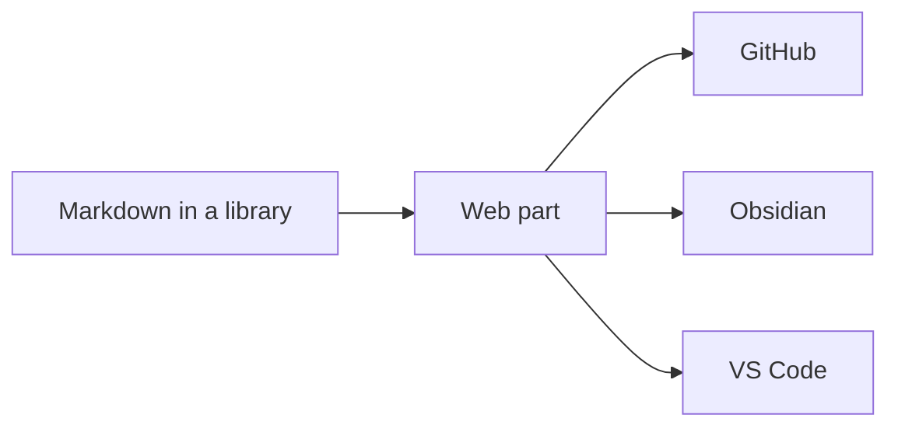

# Markstrata Markdown

A SharePoint Framework web part that renders markdown with themes modelled on
**GitHub**, **Obsidian** and **VS Code**, in light and dark.

Use the controls at the top of this page to change theme, colour mode, width and
spacing — this page is rendered by the web part's own pipeline and stylesheets,
so what you see here is what a SharePoint page shows.

> [!TIP] Two things to try
> **[The kitchen sink](themes/)** renders every feature at once — callouts, code,
> tables, diagrams, maths — so you can judge a theme at a glance.
>
> **[The working demo](app/)** is the web part itself: toolbar, contents sidebar,
> copy buttons, the reader theme switcher, and the split editor with its live
> preview. Type in it.

## Why it exists

Markdown web parts for SharePoint tend to render code blocks and note blocks
that are hard to read: a fixed dark code background whatever the page theme, one
syntax palette baked in, and callouts with harsh fills. This one treats the
theme as data — every colour, font and shape is a CSS custom property — so the
whole page follows the editor your documentation is actually written in.

```typescript title="ThemeManager.ts"
/** Resolves the configured mode into a concrete light or dark value. */
export function resolveMode(mode: ColorMode, isInverted?: boolean): ResolvedMode {
  if (mode === 'light' || mode === 'dark') {
    return mode;
  }
  return isInverted ? 'dark' : 'light';
}
```

## Callouts, three syntaxes

> [!NOTE]
> GitHub alert syntax: NOTE, TIP, IMPORTANT, WARNING and CAUTION.

> [!question] Obsidian callouts, with a title of your own
> All of Obsidian's types, including foldable ones.

> Wiki.js classes from older SharePoint markdown web parts still render.
{.is-success}

## Install it

Download the `.sppkg` from the
[latest release](https://github.com/CodyRWhite/Markdown-Formatter-SPO/releases/latest),
upload it to your tenant App Catalog, and add **Markstrata Markdown** to a page.
Nothing is fetched from a CDN at runtime.

| Where to look | What is there |
|---|---|
| [README](https://github.com/CodyRWhite/Markdown-Formatter-SPO#readme) | Features, configuration, deployment |
| [THEMES.md](https://github.com/CodyRWhite/Markdown-Formatter-SPO/blob/main/THEMES.md) | The token contract, and how to add a theme |
| [CONTRIBUTING.md](https://github.com/CodyRWhite/Markdown-Formatter-SPO/blob/main/CONTRIBUTING.md) | Branches, commits, releases |


