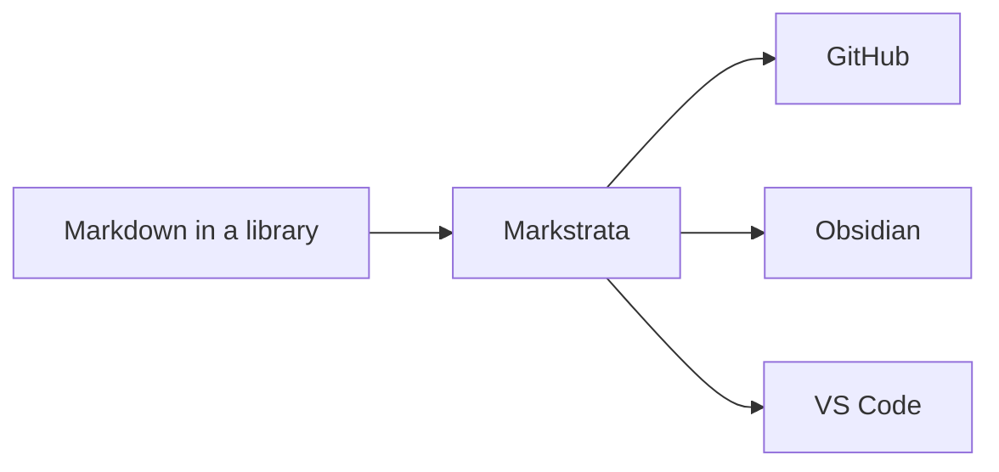

# Documentation

Everything the web part does, and how to configure it.

[[toc]]

## Install

Download `markstrata.sppkg` from the
[latest release](https://github.com/CodyRWhite/Markstrata/releases/latest).

1. Upload it to your tenant **App Catalog** (`/sites/appcatalog`, the *Apps for
   SharePoint* library).
2. When prompted, choose **Enable this app and add it to all sites**, or leave
   it unticked and add it per site from *Site contents → New → App*.
3. Edit a page, add a web part, and pick **Markstrata** from the
   **Content** group.

> [!TIP] Upgrading
> Upload the newer `.sppkg` over the old one and choose **Replace**. The
> solution and web part IDs never change between versions, so a tenant sees an
> upgrade rather than a second app, and pages keep their settings.
>
> Every release ships the file under the same name for this reason: the App
> Catalog matches an upload to the solution it replaces by file name, and a
> version in the name gets it refused with *"A solution with the same product
> ID already exists."* The version lives in the release tag and inside the
> package, which is where SharePoint reads it.

To build the package yourself you need Node.js 22:

```bash
npm install
npm run package          # writes sharepoint/solution/markstrata.sppkg
```

## Where the content comes from

The **Content** page of the property pane, the first of its four, offers three
sources.

| Source | What it does |
|---|---|
| **Typed in** | Markdown lives in the web part itself. Good for a page-specific note. |
| **Library file** | **Markdown file** picks a `.md` file from a document library, with folder browsing. **Reload when the file changes** keeps the page in step with edits, and **Show version history button** lets a reader browse the file's versions, with preview and restore. |
| **URL** | **File URL** takes any address that returns markdown. |

A library file is usually the right answer: the markdown stays in SharePoint
where it can be versioned, permissioned and edited by people who never touch
the page.

## Appearance

**Theme**: GitHub, Obsidian or VS Code.

**Colour mode**: light, dark, or *follow the page*, which takes its cue from
the SharePoint site theme so a dark intranet gets a dark web part.

**Let readers switch theme**: adds a control to the rendered page. A reader's
choice is remembered per web part in their own browser and never changes what
anyone else sees.

**Content width, spacing and text size**: independent of theme, so you can run
GitHub's look at a narrower measure or a larger size without editing anything.

**Fill the available height**: gives the web part at least the room below where
it starts, so a short document does not stop halfway down and leave the page
canvas showing under it. With the file name and modified date shown, they sit at
the bottom of that rather than under a gap, which is usually the reason for
turning it on.

> [!NOTE]
> The room is measured on the page, not written as `100vh`. A SharePoint page
> does not scroll the window: it scrolls an inner container under a header and a
> command bar, so a viewport unit overshoots by however tall that chrome is.
> It is measured from where the web part starts too, so a part placed under
> other content on a long page has no room below it and is left as it is.

## The toolbar and the file footer

Both are on the **Features** page of the pane, under **Toolbar** and **File
information**: they are what shows around the document rather than part of it.

**Show toolbar** carries the reload, version history, theme and print controls,
and **Show print button** decides whether the print one is among them. Set the
toolbar to *only while editing the page* and readers never see any of them, that
button included.

**Show file name and last updated**: a footer with the file's name, when it was
last changed and by whom. It needs a file from a document library, since that is
the only source with any of those to show. **Keep it in view while scrolling**
pins it to the bottom of the web part rather than leaving it at the end of the
document, which in a long one means a reader never reaches it.

## Code blocks

````markdown
```typescript title="ThemeManager.ts"
export function resolveMode(mode: ColorMode): ResolvedMode {
  return mode === 'light' || mode === 'dark' ? mode : 'light';
}
```
````

- Syntax highlighting for around forty languages, including PowerShell,
  Dockerfile, batch and HTTP on top of the common set.
- **Show language header** labels the block with its language and, with
  `title="app.ts"`, a filename.
- A copy button that copies the source and never the line numbers.
- **Show line numbers** puts them in a gutter that stays put while a long line
  scrolls under it, and that wrapped lines indent past rather than run under.
- Diff blocks tint whole lines, so `+` and `-` read at a glance.

**Long lines** decides what a line too wide for the column does: wrap, or scroll
sideways. It applies to every block on the page, and any block can override it,
or the line numbers, on its fence:

| Flag | Effect |
|---|---|
| `wrap` / `nowrap` | Soft wrap, or horizontal scroll |
| `numbers` / `nonumbers` | Line numbers on or off for this block |
| `title="name.ts"` | Filename in the header |

**Code text size** sets code independently of body text, so a dense block can
be brought down a notch without shrinking the prose around it.

## Callouts

Three syntaxes, one rendering, so markdown written for GitHub, for Obsidian or
for an older SharePoint web part all render correctly without editing.

```markdown
> [!NOTE]
> GitHub alert syntax: NOTE, TIP, IMPORTANT, WARNING, CAUTION.

> [!tip] Obsidian callout with a title of your own
> Types: note, abstract, info, todo, tip, important, success, question,
> warning, caution, failure, danger, bug, example, quote, and their aliases.

> [!warning]- Foldable, collapsed by default
> `-` starts collapsed, `+` starts open.

> Wiki.js classes still render.
{.is-info}
```

Foldable callouts are a `<details>` element, so they need no JavaScript, work
with a keyboard, and print expanded.

## Also rendered

Tables (including colspan, rowspan and alignment), task lists, footnotes,
definition lists, abbreviations, emoji, sub/sup, `==highlighted==` text, heading
anchors, [Mermaid](https://mermaid.js.org/) diagrams themed to match the page,
and KaTeX maths.



## Images

`` works the way it does on
GitHub. A relative path is resolved against the folder holding the markdown
file, not the page the web part sits on, so a document library laid out like
this renders as written:

```text
Shared Documents/runbooks/
  deploy.md          <- 
  images/flow.png
```

Absolute URLs, protocol-relative URLs, data URIs and paths that already start
with `/` are left untouched. Content typed into the web part has no folder of
its own, so its relative paths resolve against the site root.

Images are given `loading="lazy"` and `decoding="async"`, so a long document
fetches them as the reader reaches them rather than all at once.

> [!NOTE]
> Readers see only the images they have permission to open. A relative path
> resolves to a real SharePoint URL, and SharePoint still applies the
> library's permissions to it.

## Diagrams

Mermaid diagrams are themed to match the page and re-drawn when the theme
changes. Each one carries a copy button in its top right corner that puts the
diagram on the clipboard as a PNG, drawn at twice its size on the page so it
stays sharp when it is pasted into a deck or a document. Selecting a diagram
would only get you its source, which is rarely what you want.

A gantt chart lays out from its time axis rather than wrapping, so it asks for
more width than a column usually has. **Wide diagrams** decides what happens
then:

| Setting | What it does |
|---|---|
| Fit to the column | Lays the chart out at the column width, compressing the axis. The text stays full size and there is no scrollbar. The default. |
| Keep their size and scroll | The chart keeps its natural width and the box scrolls sideways. |
| Scale down to fit | Shrinks the whole drawing, text included. Mermaid's own behaviour. |

## Table of contents

Built from the headings, or placed inline with `[[toc]]`. It can sit in a left
or right column, above the content, or be switched off. It has a pane page of
its own, **Contents**, since between the position, the depth and the width
there is more to it than one setting.

**Deepest heading in the contents** decides how far down it goes, from top-level
headings only through to every level. A long document with four levels of
heading usually reads better listing two or three of them.

**Heading link anchors** put a link beside each heading, so a section can be
linked to directly. They are reserved a gutter of their own rather than sitting
in the margin, where a SharePoint page canvas clips them.

It is a column of the layout or a block above the text, never an overlay, so
it cannot cover the content or the page's own editing controls. In a narrow
column it collapses to a single line you can expand, and while the page is being
edited it stops sticking to the top of the screen. The entry for the heading you
are reading is highlighted as you scroll.

### How wide the sidebar is

With the contents in a left or right sidebar, **Contents width** decides how
much room they take. Stacked above the content in a narrow column the setting
does not apply: there they are always full width.

**Auto** fits the sidebar to its longest entry, so there is no gap beside short
headings and no wrapping of long ones. It is floored and capped, so a document
with three short headings still reads as a column and one deep heading cannot
take the page.

**Fixed** adds **Measured in** for the unit and a **Width**, given as both a
slider and a box:

| Unit | What it measures | Worth knowing |
|---|---|---|
| `em` | The contents' own text size | Keeps the same characters per line as the text size changes. The best choice for most documents. |
| `%` | A share of the web part | Adapts to the column the web part is placed in. |
| `px` | A fixed number of pixels | Predictable, but ignores both text size and column width. |
| `vw` | A share of the browser window | Measures the window rather than the web part, so a narrow column and a full-width one get the same sidebar. Rarely what you want. |

## Editing in the page

Put the page in edit mode and the web part becomes a split editor: markdown on
the left, live preview on the right, with **Edit / Split / Preview** layouts. If
the content came from a library file, **Save to SharePoint** writes it back,
warning you first if someone else has saved it since you opened it. `Ctrl+S`
saves.

It is a plain textarea rather than Monaco, deliberately: it always loads, and a
large editor bundle is hard to justify for the short edits that happen on a
SharePoint page.

## Defaults

A web part you have just added starts on the **VS Code** theme in light mode,
comfortable width, compact spacing, contents above the content, and line numbers
on. It is as tall as its content, and raw HTML is off. Every one of those is a
setting.

## Security

> [!IMPORTANT] Raw HTML is off by default
> Unless you deliberately turn **Allow raw HTML in markdown** on, HTML in the
> markdown is escaped. Callout titles are escaped either way. Mermaid runs with
> `securityLevel: 'strict'` and HTML labels disabled, so diagram text can never
> become markup.

`npm audit --omit=dev` reports no advisories: nothing that ships to the browser
has a known vulnerability.

## Going further

| Where | What is there |
|---|---|
| [README](https://github.com/CodyRWhite/Markstrata#readme) | Features, configuration, deployment |
| [THEMES.md](https://github.com/CodyRWhite/Markstrata/blob/main/THEMES.md) | The token contract, and how to add a fourth theme |
| [CONTRIBUTING.md](https://github.com/CodyRWhite/Markstrata/blob/main/CONTRIBUTING.md) | Branches, commits, releases |
| [Issues](https://github.com/CodyRWhite/Markstrata/issues) | Bugs and requests |
