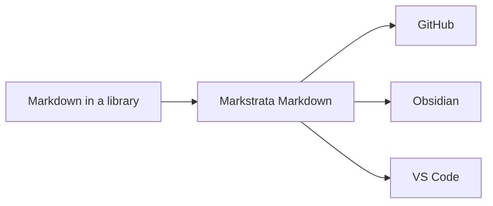

# Documentation

Everything the web part does, and how to configure it.

[[toc]]

## Install

Download `markstrata.sppkg` from the
[latest release](https://github.com/CodyRWhite/Markstrata/releases/latest).

1. Upload it to your tenant **App Catalog** (`/sites/appcatalog`, the *Apps for
   SharePoint* library).
2. When prompted, choose **Enable this app and add it to all sites**, or leave
   it unticked and add it per site from *Site contents → New → App*.
3. Edit a page, add a web part, and pick **Markstrata Markdown** from the
   **Content** group.

> [!TIP] Upgrading
> Upload the newer `.sppkg` over the old one and choose **Replace**. The
> solution and web part IDs never change between versions, so a tenant sees an
> upgrade rather than a second app, and pages keep their settings.
>
> Every release ships the file under the same name for this reason: the App
> Catalog matches an upload to the solution it replaces by file name, and a
> version in the name gets it refused with *"A solution with the same product
> ID already exists."* The version lives in the release tag and inside the
> package, which is where SharePoint reads it.

To build the package yourself you need Node.js 22:

```bash
npm install
npm run package          # writes sharepoint/solution/markstrata.sppkg
```

## Where the content comes from

The **Content** page of the property pane offers three sources.

| Source | What it does |
|---|---|
| **Typed in** | Markdown lives in the web part itself. Good for a page-specific note. |
| **Library file** | Pick a `.md` file from a document library, with folder browsing. Optionally reload when it changes, and browse its version history, with preview and restore. |
| **URL** | Any address that returns markdown. |

A library file is usually the right answer: the markdown stays in SharePoint
where it can be versioned, permissioned and edited by people who never touch
the page.

## Appearance

**Theme**: GitHub, Obsidian or VS Code.

**Colour mode**: light, dark, or *follow the page*, which takes its cue from
the SharePoint site theme so a dark intranet gets a dark web part.

**Let readers switch theme**: adds a control to the rendered page. A reader's
choice is remembered per web part in their own browser and never changes what
anyone else sees.

**Content width, spacing and text size**: independent of theme, so you can run
GitHub's look at a narrower measure or a larger size without editing anything.

## Code blocks

````markdown
```typescript title="ThemeManager.ts"
export function resolveMode(mode: ColorMode): ResolvedMode {
  return mode === 'light' || mode === 'dark' ? mode : 'light';
}
```
````

- Syntax highlighting for around forty languages, including PowerShell,
  Dockerfile, batch and HTTP on top of the common set.
- An optional header showing the language and, with `title="app.ts"`, a filename.
- A copy button that copies the source and never the line numbers.
- Optional line numbers in a gutter that stays put while a long line scrolls
  under it, and that wrapped lines indent past rather than run under.
- Diff blocks tint whole lines, so `+` and `-` read at a glance.

Any block can override the page setting on its fence:

| Flag | Effect |
|---|---|
| `wrap` / `nowrap` | Soft wrap, or horizontal scroll |
| `numbers` / `nonumbers` | Line numbers on or off for this block |
| `title="name.ts"` | Filename in the header |

## Callouts

Three syntaxes, one rendering, so markdown written for GitHub, for Obsidian or
for an older SharePoint web part all render correctly without editing.

```markdown
> [!NOTE]
> GitHub alert syntax: NOTE, TIP, IMPORTANT, WARNING, CAUTION.

> [!tip] Obsidian callout with a title of your own
> Types: note, abstract, info, todo, tip, important, success, question,
> warning, caution, failure, danger, bug, example, quote, and their aliases.

> [!warning]- Foldable, collapsed by default
> `-` starts collapsed, `+` starts open.

> Wiki.js classes still render.
{.is-info}
```

Foldable callouts are a `<details>` element, so they need no JavaScript, work
with a keyboard, and print expanded.

## Also rendered

Tables (including colspan, rowspan and alignment), task lists, footnotes,
definition lists, abbreviations, emoji, sub/sup, `==highlighted==` text, heading
anchors, [Mermaid](https://mermaid.js.org/) diagrams themed to match the page,
and KaTeX maths.



## Table of contents

Built from the headings, or placed inline with `[[toc]]`. It can sit in a left
or right column, above the content, or be switched off, and its depth is
configurable.

It is a column of the layout or a block above the text, never an overlay, so
it cannot cover the content or the page's own editing controls. In a narrow
column it collapses to a single line you can expand, and while the page is being
edited it stops sticking to the top of the screen. The entry for the heading you
are reading is highlighted as you scroll.

## Editing in the page

Put the page in edit mode and the web part becomes a split editor: markdown on
the left, live preview on the right, with **Edit / Split / Preview** layouts. If
the content came from a library file, **Save to SharePoint** writes it back,
warning you first if someone else has saved it since you opened it. `Ctrl+S`
saves.

It is a plain textarea rather than Monaco, deliberately: it always loads, and a
large editor bundle is hard to justify for the short edits that happen on a
SharePoint page.

## Defaults

A web part you have just added starts on the **VS Code** theme in light mode,
comfortable width, compact spacing, contents above the content, and line numbers
on. Raw HTML is off. Every one of those is a setting.

## Security

> [!IMPORTANT] Raw HTML is off by default
> HTML in markdown is escaped unless you deliberately turn **Allow raw HTML** on.
> Callout titles are escaped either way. Mermaid runs with
> `securityLevel: 'strict'` and HTML labels disabled, so diagram text can never
> become markup.

`npm audit --omit=dev` reports no advisories: nothing that ships to the browser
has a known vulnerability.

## Going further

| Where | What is there |
|---|---|
| [README](https://github.com/CodyRWhite/Markstrata#readme) | Features, configuration, deployment |
| [THEMES.md](https://github.com/CodyRWhite/Markstrata/blob/main/THEMES.md) | The token contract, and how to add a fourth theme |
| [CONTRIBUTING.md](https://github.com/CodyRWhite/Markstrata/blob/main/CONTRIBUTING.md) | Branches, commits, releases |
| [Issues](https://github.com/CodyRWhite/Markstrata/issues) | Bugs and requests |
