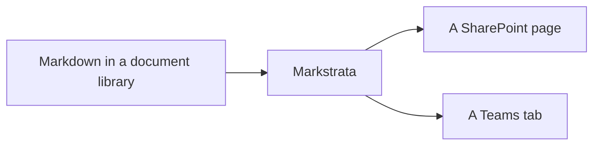

# Markdown for SharePoint, and for Teams

<p class="site-lead">Markstrata is a SharePoint Framework web part that renders
markdown out of a document library, themed like the editors the markdown was
written in: GitHub, Obsidian and VS Code, in light and dark. A Teams channel's
Files are a document library, so the same web part shows the same documents as
a tab.</p>

This page is rendered by the web part's own pipeline and stylesheets. So is
every other page here. Nothing on this site can claim a feature the code has
stopped doing.

<div class="site-split">
<a class="site-card" href="install/">
  <span class="site-card-kicker">Evaluate</span>
  <span class="site-card-title">Deciding whether to install it</span>
  <span class="site-card-text">What it looks like, what it asks of a tenant,
  how the package reaches the App Catalog, and how the same web part becomes a
  Teams tab.</span>
</a>
<a class="site-card" href="docs/">
  <span class="site-card-kicker">Documentation</span>
  <span class="site-card-title">Writing and reading the documents</span>
  <span class="site-card-text">Every setting in the property pane, every piece
  of markdown it renders, and what happens when one document links to
  another.</span>
</a>
</div>

## Two ways to look at it

**[The demo](demo/)** is the web part itself, running its real renderer classes
in your browser: the toolbar, the contents sidebar, copy buttons, the property
pane and the split editor. Nothing is installed to open it.

**[The themes page](themes/)** renders one document that uses every feature at
once, in whichever theme you pick, so a theme can be judged in one screen rather
than six.

## What it renders

Markdown web parts for SharePoint tend to render the two things documentation is
mostly made of, code and notes, in a way that is tiring to read: a fixed dark
code background whatever the page theme is, one syntax palette baked in, and
callouts with fills that fight the text on them. Markstrata treats the theme as
data. Every colour, font and shape is a CSS custom property, and a theme is a
file that sets them, so the page can follow the editor the documentation is
actually written in.

```typescript title="ThemeManager.ts"
/** Resolves the configured mode into a concrete light or dark value. */
export function resolveMode(mode: ColorMode, isInverted?: boolean): ResolvedMode {
  if (mode === 'light' || mode === 'dark') {
    return mode;
  }
  return isInverted ? 'dark' : 'light';
}
```

Callouts are written three ways and rendered one way, so a document written for
GitHub, for Obsidian or for an older SharePoint web part needs no editing:

> [!NOTE]
> GitHub alert syntax: NOTE, TIP, IMPORTANT, WARNING and CAUTION.

> [!question] Obsidian callouts, with a title of your own
> All of Obsidian's types, including the foldable ones.

> Wiki.js classes from older SharePoint markdown web parts still render.
{.is-success}

Tables, task lists, footnotes, definition lists, emoji, highlights, Mermaid
diagrams themed to match the page, and KaTeX maths are all rendered as well.
[The syntax page](syntax/) has every one of them, with what you write beside
what it turns into.

## A folder of documents, not a file

A document library full of markdown is a wiki that nobody wrote a wiki for.
Markstrata reads it as one: a `[[Wiki link]]` points at the file beside it, and
following one opens that document in the web part rather than handing the reader
the raw file. The toolbar keeps the trail of documents they walked, so the way
back is the page they came from rather than the beginning.

A `?strataDoc=` parameter on the page address points the web part at any
document in the library, which is what lets a SharePoint navigation menu have
more than one entry.

**[How linking between documents works](linking/)**

## Off the screen, as a document

A reader can export what they are looking at as a paginated PDF: a cover, a
contents page carrying the page number each heading landed on, running headers
naming the document and the section, and breaks that keep a heading with its
text and a table row off the fold.

The page numbers are the part a browser cannot do on its own. Nothing knows what
page a heading is on until the pages exist, which is why printing a web page
gives you a list of headings and no numbers beside them. The pages are worked
out first, and then the contents can say.

**[What an export contains](reading/#export)**

## In Microsoft Teams

A channel's Files tab is a folder in a SharePoint document library. That is the
whole reason this works: a Markstrata tab in a channel is the same web part,
reading the same library, so a runbook is one document rather than one document
and a copy of it.

**[How the Teams tab is installed and configured](teams/)**

## Installing it

Download the `.sppkg` from the
[latest release](https://github.com/CodyRWhite/Markstrata/releases/latest),
upload it to your tenant App Catalog, and add **Markstrata** to a page. Nothing
is fetched from a CDN while it runs: the parsing, the highlighting, the maths
fonts and the diagram renderer are all inside the package.

**[Install notes, upgrades and what it asks of a tenant](install/)**



Markstrata is free and MIT licensed. If it saved you an afternoon,
[there are ways to say thanks](support/), most of which cost nothing.
