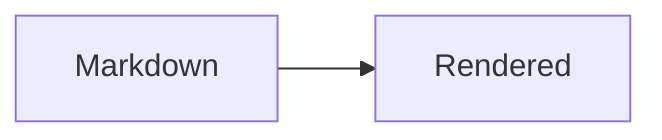

# Syntax

Everything Markstrata renders, with the markdown you write beside what it turns
into. The page is built through the web part's own pipeline, so each example
below is rendered by the same code a SharePoint page runs: if something here
stops working, this page stops showing it.

Where a feature is off by default, or belongs to a setting, the setting is
named. The [documentation page](../docs/) covers the settings themselves.

[[toc]]

## Text

| Write | Get |
|---|---|
| `**bold**` | **bold** |
| `*italic*` | *italic* |
| `~~struck through~~` | ~~struck through~~ |
| `~also struck~` | ~also struck~ |
| `` `inline code` `` | `inline code` |
| `==highlighted==` | ==highlighted== |
| `$H_2O$` | $H_2O$ |
| `10^6^` | 10^6^ |
| `<kbd>Ctrl</kbd>` | <kbd>Ctrl</kbd> |
| `:rocket:` | :rocket: |

Punctuation is left exactly as it is written. A double hyphen stays a double
hyphen and a straight quote stays straight, so `--force` in a sentence is still
something a reader can copy and run. A bare address like https://example.com is
turned into a link without being written as one.

An abbreviation is declared once and explains itself wherever it appears:

```markdown
*[HTML]: HyperText Markup Language
```

## Headings and links

```markdown
## A heading

[a link](https://example.com)
[a heading on this page](#text)
```

Headings get the same id GitHub gives them - lower case, punctuation dropped,
spaces to hyphens, so `## Step 1: Install` is `#step-1-install` - which means a
link written against the page on GitHub lands here too. A heading also answers
to the id it was given before this web part moved to GitHub's rule, so an
anchor written against an older version still lands. With
**Heading link anchors** on there is a `#` beside each heading to copy. A link to another site opens in a new tab.

An address written on its own becomes a link, including one that starts
`www.` with no scheme in front of it. A bare file name does not: `notes.md` in
a sentence is a file name, not an address.

### Wiki links

Off by default, under **Wiki links**.

| Write | Links to |
|---|---|
| `[[Deploy runbook]]` | `Deploy runbook.md` in the same folder |
| `[[Deploy runbook\|how we ship]]` | the same file, worded for the sentence |
| `[[Deploy runbook#Rollback]]` | that heading in that file |
| `[[#Text]]` | a heading in this document |

With a library file, a link to a page that is not there is marked.

## Lists

```markdown
1. Ordered
2. Second
   1. Nested

- Unordered
  - Nested

- [x] Done
- [ ] Not done
```

A definition list:

```markdown
Term
: What it means
```

## Callouts

Three syntaxes, all rendered the same way. GitHub alerts:

```markdown
> [!NOTE]
> Useful information.
```

`NOTE`, `TIP`, `IMPORTANT`, `WARNING` and `CAUTION`.

Obsidian callouts, which take a title of their own and can fold. A `-` starts
folded, a `+` starts open:

```markdown
> [!tip] A title of your own
> Any of Obsidian's types.

> [!warning]- Folded to start with
> Click the title to open it.
```

`abstract`, `todo`, `success`, `question`, `failure`, `danger`, `bug`,
`example`, `quote` and `info` all work.

And the Wiki.js style older SharePoint web parts used:

```markdown
> Still renders.
{.is-success}
```

## Code

````markdown
```typescript title="theme.ts"
export const mode = 'dark';
```
````

`` ```ts:theme.ts `` is accepted as shorthand for the same thing.

A fence can override the page's own settings, and call out the lines that
matter:

| Flag | Effect |
|---|---|
| `wrap` / `nowrap` | wrap long lines, or scroll them |
| `numbers` / `nonumbers` | show or hide the line gutter |
| `{2,4-6}` | call out those lines and fade the rest |

````markdown
```python wrap nonumbers
```

```js {2,4-6}
```
````

## Tables

```markdown
| Left | Centre | Right |
|:-----|:------:|------:|
| one | two | 3 |
```

A pipe inside a cell is written `\|`, which is the only escape a cell has, and
works inside a code span as well as outside one. A row with too few cells is
padded out to the table and a row with too many is trimmed to it.

`^^` merges a cell with the one above it, and a doubled `||` mid-row runs a
cell across the column to its right:

```markdown
| Service | Host |
|---------|------|
| Orders  | db01 |
| ^^      | db02 |
| Both share a host || db02 |
```

## Images

| Write | Effect |
|---|---|
| `` | resolved against the folder the document is in |
| `` | 300 pixels wide, aspect ratio kept |
| `` | and told the picture's shape, so nothing jumps |
| `` | a figure with a visible caption |
| `{.center}` | placed against the page's own setting |

An image that is a paragraph of its own can be clicked to see it full size.

## Diagrams and maths

````markdown

````

Maths needs **Math (KaTeX)** on, and is written whichever way the editor it
came from writes it:

| Write | Effect |
|---|---|
| `$E = mc^2$` | inline, in the line it is in |
| ``$`E = mc^2`$`` | inline, GitHub's form, for an expression full of markdown characters |
| `$$E = mc^2$$` | display, in the middle of a sentence |
| `$$` on its own line, then the maths, then `$$` | display, in a block of its own |
| a fence labelled ```` ```math ```` | display, the same block |

A display block can follow straight on from the line that introduces it, and
works inside a list item and inside a quote.

## Comments

```markdown
Ready to ship %%ask Dave first%%

%%
Not for the reader.
%%
```

Anything between a pair of `%%` is left out of the page, inline or over
several lines, the way Obsidian leaves it out. A marker with nothing closing it
is shown as written rather than hiding the rest of the document.

## Footnotes

```markdown
A claim[^1].

[^1]: The support for it.
```

## The contents

`[[toc]]` on a line of its own puts a contents where you write it. A list of
links to headings under a *Contents* heading counts too, and either is used in
place of the generated one.

## Frontmatter

A block of metadata at the top of the file, the way Obsidian, Hugo and Jekyll
write it, is taken off rather than rendered:

```markdown
---
title: Deploy runbook
author: Ops
tags: [ops, sharepoint]
---
```

`title`, `author` and `tags` are shown in the file footer. `+++` works too.

## Raw HTML

Escaped unless **Allow raw HTML in markdown** is on. Callout titles are escaped
either way.
