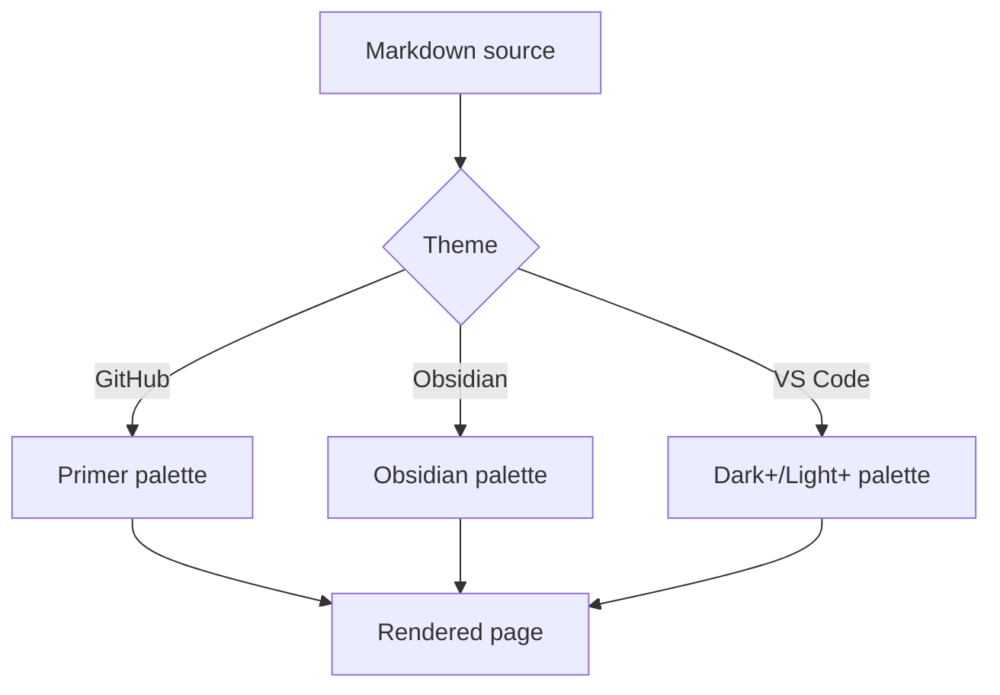
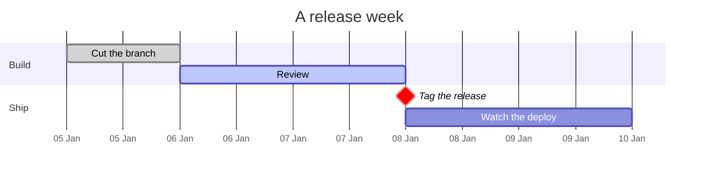

# Kitchen sink

A page that exercises everything the web part renders, so a theme can be judged
at a glance. Switch theme and colour mode with the controls above.

[[toc]]

## Text

Regular paragraph text with **bold**, *italic*, ~~strikethrough~~, `inline code`,
a [link to SharePoint](https://www.microsoft.com/sharepoint), ==nothing exotic==,
and a keyboard shortcut like <kbd>Ctrl</kbd> + <kbd>K</kbd>.

One tilde strikes through as well as two, so ~this~ and ~~this~~ match.
%%This note is written for the author and never reaches the page.%%
With **Tags** on, #kitchen-sink and #themes/obsidian are shown as tags.
Superscript is written 10^6^, and a subscript comes from maths, $H_2O$, or from
<sub>markup</sub>. Emoji render from their
shortcodes: :rocket: :warning: :white_check_mark:. An
abbreviation carries its meaning on hover, so HTML and CSS explain themselves the
first time someone meets them.

*[HTML]: HyperText Markup Language
*[CSS]: Cascading Style Sheets

> A plain blockquote, for quoting someone rather than flagging something.
> It should read as quiet, not as an alert.

---

## Callouts

> [!NOTE]
> Useful information that users should know, even when skimming content.

> [!TIP]
> Helpful advice for doing things better or more easily.

> [!IMPORTANT]
> Key information users need to know to achieve their goal.

> [!WARNING]
> Urgent info that needs immediate user attention to avoid problems.

> [!CAUTION]
> Advises about risks or negative outcomes of certain actions.

> [!question] Does it support Obsidian's types too?
> Yes: abstract, todo, success, question, failure, danger, bug, example and quote.

> [!bug] Known issue
> Nested content works: lists, code, even other callouts.
>
> ```bash
> npm run package
> ```

> [!example]- Foldable, collapsed
> Click the title to open. This is a `<details>` element, so it prints expanded
> and works without JavaScript.

> Legacy Wiki.js syntax from the older web part still renders.
{.is-success}

## Links between pages

With **Wiki links** on, `[[Another page]]` links to that file in the same
folder, the way Obsidian and older wikis write one. A link to [[deploy]] points
at a page that is there; a link to [[a page nobody wrote]] is marked, because
the folder was listed and it was not in it. You can also write
[[deploy|a label of your own]] or jump to [[deploy#Rollback]], and [[#Images]]
goes to a heading in this document. A link inside a table is written with an
escaped pipe, [[deploy\|the runbook]], so the pipe does not end the cell.

This paragraph is named, so a link elsewhere can point straight at it. ^kitchen

## Images

A relative source resolves against the folder the markdown lives in, the way it
does on GitHub, rather than against the page it is rendered on:


An embed puts a picture on the page the way Obsidian writes one,
![[brand/mark.svg|48]], and an embed of something that cannot be put on a page
without fetching it, ![[deploy]], is marked as an embed and linked instead.

An absolute source is left exactly as written, so a data URI renders without
fetching anything. Note that markdown-it accepts `data:` only for `png`, `gif`,
`jpeg` and `webp`; an SVG data URI is refused, because an SVG can carry script:  inline,
in the middle of a sentence, sitting on the text baseline.

Reference style works too, which keeps a long source out of the prose:

![The mark again][mark-ref]

[mark-ref]: brand/mark.svg "Declared once at the foot of the document"

A width can be asked for after a pipe, the way Obsidian writes it, as
`![alt|240]` or `![alt|240x120]`. The number is set as the image's width rather
than as a style, so the browser knows the shape of the picture before it has
loaded one and the text below does not jump as it arrives. Height is left to
the stylesheet, so the aspect ratio holds:


A document can place one picture itself, whatever the page is set to, by giving
the image a class. This one asks to be centred:

{.center}

An image that is a paragraph on its own and carries a title becomes a figure,
with the title as its caption rather than as a tooltip nobody on a touch screen
can see:


## Code

```typescript title="ThemeManager.ts"
/** Resolves the configured mode into a concrete light or dark value. */
export function resolveMode(mode: ColorMode, isInverted?: boolean): ResolvedMode {
  if (mode === 'light' || mode === 'dark') {
    return mode;
  }
  if (typeof isInverted === 'boolean') {
    return isInverted ? 'dark' : 'light';
  }
  return window.matchMedia('(prefers-color-scheme: dark)').matches ? 'dark' : 'light';
}
```

```python
from dataclasses import dataclass

@dataclass
class Theme:
    name: str
    dark: bool = False

    def label(self) -> str:
        """Human readable name."""
        return f"{self.name} ({'dark' if self.dark else 'light'})"

print(Theme("Obsidian", dark=True).label())  # Obsidian (dark)
```

A fence can override the page's own settings. This one wraps its long lines and
turns the gutter off, whatever the web part is set to:

```powershell wrap nonumbers
# Deploy the package to the tenant app catalog
$ctx = Connect-PnPOnline -Url "https://contoso.sharepoint.com/sites/apps" -Interactive
Add-PnPApp -Path .\sharepoint\solution\markstrata.sppkg -Scope Tenant -Publish
Get-PnPApp | Where-Object { $_.Title -like "*markdown*" } | Format-Table Title, Deployed
```

And this one forces the gutter on and scrolls instead of wrapping:

```json numbers nowrap
{
  "themeFamily": "obsidian",
  "colorMode": "dark",
  "showLineNumbers": true,
  "features": ["mermaid", "katex", "callouts"],
  "enabled": true
}
```

A fence can also call out the lines that matter, the way Docusaurus and
VitePress write it. The rest of the block is faded rather than the called lines
being tinted, so it reads the same against every theme's syntax colours, and
hovering the block brings it all back:

```typescript {3,6-7}
export function resolveMode(mode: ColorMode, isInverted?: boolean): ResolvedMode {
  if (mode === 'light' || mode === 'dark') {
    return mode;
  }
  if (typeof isInverted === 'boolean') {
    return isInverted ? 'dark' : 'light';
  }
  return window.matchMedia('(prefers-color-scheme: dark)').matches ? 'dark' : 'light';
}
```

```diff
- --strata-code-bg: #212121;
- text-shadow: 0 -0.1em 0.2em #000;
+ --strata-code-bg: var(--strata-code-bg);
+ /* contrast comes from the theme, not from a shadow */
```

An indented code block, with no language:

    $env:SPFX_SERVE_TENANT_DOMAIN = "contoso"
    gulp serve --nobrowser

## Tables

| Theme | Light background | Dark background | Code block | Callout shape |
|-------|------------------|-----------------|------------|---------------|
| GitHub | `#ffffff` | `#0d1117` | flat fill, 6px radius | accent bar, no fill |
| Obsidian | `#ffffff` | `#1e1e1e` | fill, 8px radius | tinted panel + title row |
| VS Code | `#ffffff` | `#1f1f1f` | bordered, 3px radius | tint + 3px bar |

| Aligned left | Centered | Right |
|:-------------|:--------:|------:|
| one | two | 3 |
| four | five | 60 |

Cells can span. `^^` merges a cell with the one above it, and a doubled `||`
lets a cell run across the column to its right:

| Service   | Database   | Host             |
|-----------|------------|------------------|
| Orders    | orders-db  | db01.example.com |
| Catalogue | catalog-db | db02.example.com |
| ^^        | search-db  | db02.example.com |
| Both catalogue databases share a host || db02.example.com |

## Lists

1. Ordered item
2. Second item
   1. Nested ordered
   2. Another
3. Third

- Unordered item
- With a nested list
  - Second level
    - Third level

- [x] Fix code block contrast
- [x] Add GitHub alerts and Obsidian callouts
- [ ] Ship it

Term
: A definition list entry.

Another term
: Its definition.

## Math

Inline: the Lorentz factor is $\gamma = 1/\sqrt{1 - v^2/c^2}$, and GitHub's
backtick form $`a^2 + b^2 = c^2`$ beside it.

The sum of the first n numbers is:
$$
\sum_{i=1}^{n} i = \frac{n(n+1)}{2}
$$

A fence labelled `math` is the same block:

```math
\int_0^1 x^2 \, dx = \frac{1}{3}
```

## Diagram



A gantt chart, which mermaid lays out differently from a flowchart and which
is the one that used to render its labels too small to read:



## Footnotes

Themes are defined entirely in CSS custom properties[^1], so adding a fourth one
is a data change[^2].

[^1]: See `src/webparts/markstrata/styles/base.css` for the full token list.
[^2]: Copy a file in `styles/themes/`, change the values, add it to the dropdown.
