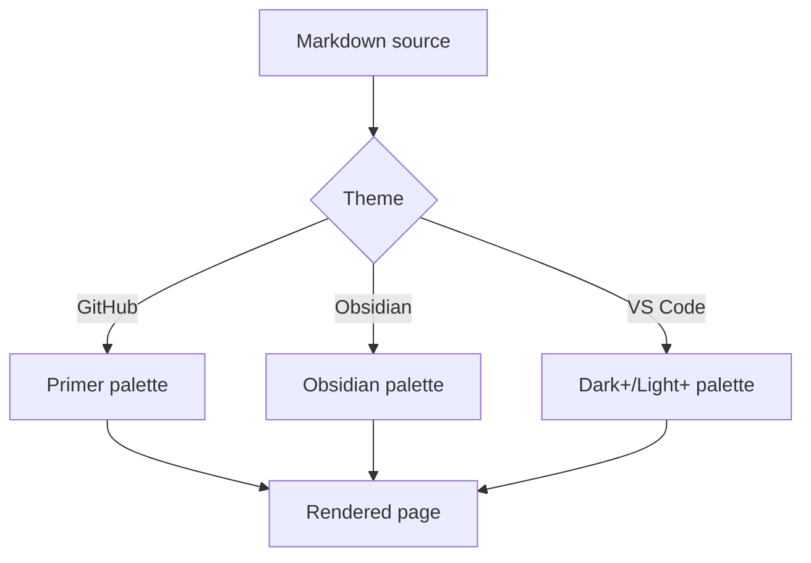

# Kitchen sink

A page that exercises everything the web part renders, so a theme can be judged
at a glance. Switch theme and colour mode with the controls above.

## Text

Regular paragraph text with **bold**, *italic*, ~~strikethrough~~, `inline code`,
a [link to SharePoint](https://www.microsoft.com/sharepoint), ==nothing exotic==,
and a keyboard shortcut like <kbd>Ctrl</kbd> + <kbd>K</kbd>.

> A plain blockquote, for quoting someone rather than flagging something.
> It should read as quiet, not as an alert.

---

## Callouts

> [!NOTE]
> Useful information that users should know, even when skimming content.

> [!TIP]
> Helpful advice for doing things better or more easily.

> [!IMPORTANT]
> Key information users need to know to achieve their goal.

> [!WARNING]
> Urgent info that needs immediate user attention to avoid problems.

> [!CAUTION]
> Advises about risks or negative outcomes of certain actions.

> [!question] Does it support Obsidian's types too?
> Yes — abstract, todo, success, question, failure, danger, bug, example and quote.

> [!bug] Known issue
> Nested content works: lists, code, even other callouts.
>
> ```bash
> npm run package
> ```

> [!example]- Foldable, collapsed
> Click the title to open. This is a `<details>` element, so it prints expanded
> and works without JavaScript.

> Legacy Wiki.js syntax from the older web part still renders.
{.is-success}

## Code

```typescript title="ThemeManager.ts"
/** Resolves the configured mode into a concrete light or dark value. */
export function resolveMode(mode: ColorMode, isInverted?: boolean): ResolvedMode {
  if (mode === 'light' || mode === 'dark') {
    return mode;
  }
  if (typeof isInverted === 'boolean') {
    return isInverted ? 'dark' : 'light';
  }
  return window.matchMedia('(prefers-color-scheme: dark)').matches ? 'dark' : 'light';
}
```

```python
from dataclasses import dataclass

@dataclass
class Theme:
    name: str
    dark: bool = False

    def label(self) -> str:
        """Human readable name."""
        return f"{self.name} ({'dark' if self.dark else 'light'})"

print(Theme("Obsidian", dark=True).label())  # Obsidian (dark)
```

```powershell
# Deploy the package to the tenant app catalog
$ctx = Connect-PnPOnline -Url "https://contoso.sharepoint.com/sites/apps" -Interactive
Add-PnPApp -Path .\sharepoint\solution\markstrata.sppkg -Scope Tenant -Publish
Get-PnPApp | Where-Object { $_.Title -like "*markdown*" } | Format-Table Title, Deployed
```

```json
{
  "themeFamily": "obsidian",
  "colorMode": "dark",
  "showLineNumbers": true,
  "features": ["mermaid", "katex", "callouts"],
  "enabled": true
}
```

```diff
- --ink-code-bg: #212121;
- text-shadow: 0 -0.1em 0.2em #000;
+ --ink-code-bg: var(--ink-code-bg);
+ /* contrast comes from the theme, not from a shadow */
```

An indented code block, with no language:

    $env:SPFX_SERVE_TENANT_DOMAIN = "contoso"
    gulp serve --nobrowser

## Tables

| Theme | Light background | Dark background | Code block | Callout shape |
|-------|------------------|-----------------|------------|---------------|
| GitHub | `#ffffff` | `#0d1117` | flat fill, 6px radius | accent bar, no fill |
| Obsidian | `#ffffff` | `#1e1e1e` | fill, 8px radius | tinted panel + title row |
| VS Code | `#ffffff` | `#1f1f1f` | bordered, 3px radius | tint + 3px bar |

| Aligned left | Centered | Right |
|:-------------|:--------:|------:|
| one | two | 3 |
| four | five | 60 |

## Lists

1. Ordered item
2. Second item
   1. Nested ordered
   2. Another
3. Third

- Unordered item
- With a nested list
  - Second level
    - Third level

- [x] Fix code block contrast
- [x] Add GitHub alerts and Obsidian callouts
- [ ] Ship it

Term
: A definition list entry.

Another term
: Its definition.

## Math

Inline: the Lorentz factor is $\gamma = 1/\sqrt{1 - v^2/c^2}$.

$$
\sum_{i=1}^{n} i = \frac{n(n+1)}{2}
$$

## Diagram



## Footnotes

Themes are defined entirely in CSS custom properties[^1], so adding a fourth one
is a data change[^2].

[^1]: See `src/webparts/markstrata/styles/base.css` for the full token list.
[^2]: Copy a file in `styles/themes/`, change the values, add it to the dropdown.
