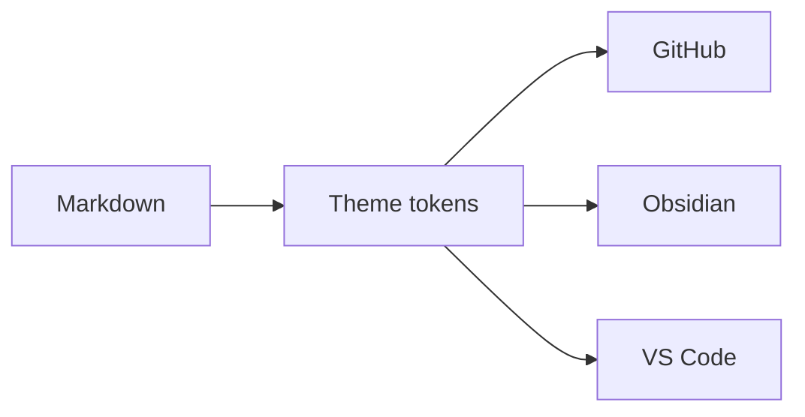

# Markstrata

Pick a theme in the property pane — **GitHub**, **Obsidian** or **VS Code**, each in light or dark — and the whole page follows: text, tables, callouts and syntax highlighting.

## Callouts

Both syntaxes work, and so does the `{.is-info}` style from older SharePoint markdown web parts.

> [!NOTE]
> GitHub alert syntax. Five types: NOTE, TIP, IMPORTANT, WARNING and CAUTION.

> [!tip] Obsidian callouts take a custom title
> And any of Obsidian's types: info, success, question, failure, bug, example, quote.

> [!warning]- Foldable, collapsed by default
> Add `-` to collapse a callout and `+` to leave it open. No JavaScript involved — it is a `<details>` element.

## Code

```typescript title="theme.ts"
// Syntax colours come from the theme, not from a fixed stylesheet.
export function resolveMode(mode: ColorMode, inverted?: boolean): 'light' | 'dark' {
  if (mode === 'light' || mode === 'dark') {
    return mode;
  }
  return inverted ? 'dark' : 'light';
}
```

## Tables and lists

| Setting | Default | What it does |
|---------|---------|--------------|
| Theme | GitHub | Which editor's look to copy |
| Colour mode | Light | Light, dark, or follow the page |
| Line numbers | Off | Gutter beside each line of code |

- [x] Readable code blocks in every theme
- [x] GitHub alerts and Obsidian callouts
- [ ] Your content

## Diagrams and math



Inline math like $E = mc^2$ and display math both render with KaTeX:

$$
\int_0^1 x^2\,dx = \frac{1}{3}
$$
